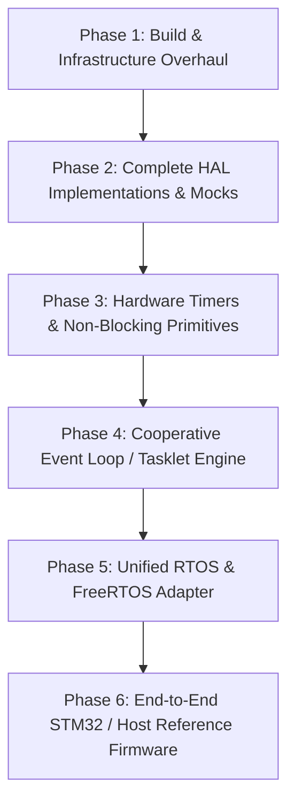

# 🏛️ ZeroEmbedded: Framework Architectural Review & Production-Readiness Roadmap

## 1. Executive Summary

**ZeroEmbedded** possesses a strong foundational design: zero dynamic heap requirement, deterministic $O(1)$ memory allocators (Bitmap Pool, Linear Arena with rewind, Bounded Buffer), lock-free SPSC circular queues, and a validated binary protocol engine (ZeroWire). The core C test suite passes 138/138 tests with zero-cost overhead empirically verified.

However, in its current state, **the framework is an SDK prototype rather than a deployable embedded framework**. Critical hardware and system layers exist only as header prototypes or disconnected files without implementations, preventing end-to-end usage in real firmware projects.

---

## 2. Comprehensive System Gap Analysis Matrix

| Subsystem | Current State | Critical Gap | Impact | Priority |
| :--- | :--- | :--- | :--- | :---: |
| **Build & Orchestration** | `core-c/CMakeLists.txt` only | No root `CMakeLists.txt`, no CTest integration, no multi-target build (host vs ARM), no installation package | Users cannot build the repo from root or integrate via `FetchContent`/`find_package` | **P0 (Blocker)** |
| **HAL Implementations** | Header declarations only (`gpio.h`, `uart.h`, `timer.h`) | Missing `gpio.c`, `uart.c`, `timer.c`. No host simulation mock; no CMSIS/STM32 implementation | Linking any HAL API results in `undefined reference / unresolved external symbol` | **P0 (Blocker)** |
| **UART & Stream Engine** | Data structures in `uart.h` | No logic to pump bytes between hardware IRQ and SPSC ringbuffers (`tx_queue`, `rx_queue`) | Users must write all UART boilerplate manually | **P1 (High)** |
| **Timer & Timeouts** | Busy-wait delays only (`fw_delay_millis`) | No non-blocking timer primitives (`fw_timer_elapsed`, `fw_timeout_t`, periodic ticker) | Real-time firmware cannot run multi-rate periodic loops without RTOS | **P1 (High)** |
| **RTOS / Scheduler** | Disconnected `baremetal_adapter.c` | Adapter not compiled into library; no compile-time backend switch (`ZERO_RTOS_BAREMETAL`, `ZERO_RTOS_FREERTOS`) | RTOS API calls fail at link time; cannot run FreeRTOS or superloop | **P1 (High)** |
| **Event Execution Engine** | Bare `main()` superloop in PoC | Lack of zero-allocation cooperative tasklet / event dispatcher | Complex bare-metal applications become spaghetti code | **P2 (Medium)** |
| **Memory Barriers** | `_ReadWriteBarrier` on MSVC | Compiler barrier only; lacking true CPU memory barrier (`__DMB()` on ARM, `MemoryBarrier()` on Win32) | Potential memory race conditions on out-of-order Cortex-M7/ESP32 | **P1 (High)** |
| **Rust FFI & Bindings** | Standalone Rust crates | No generated C header (`zero_rust.h`), no build pipeline linking Rust staticlib with C | C code cannot consume Rust safety tier without manual `extern` prototypes | **P2 (Medium)** |
| **Static Tooling** | Regex-based Python script | Only catches single-line `FW_ISR void name(` declarations; SVD codegen is hardcoded dummy | Misses standard CMSIS ISR definitions; cannot parse real vendor `.svd` files | **P2 (Medium)** |

---

## 3. Detailed Technical Deficiencies & Corrective Action

### 3.1 Gap 1: Missing Root Build System & Packaging
- **Issue**: There is no top-level `CMakeLists.txt`. Running CMake in the workspace root fails.
- **Solution**:
  1. Create root `CMakeLists.txt` enabling options: `ZERO_BUILD_TESTS`, `ZERO_BUILD_BENCHMARKS`, `ZERO_BUILD_EXAMPLES`, `ZERO_TARGET_PLATFORM` (`HOST` vs `STM32` vs `GENERIC_EMBEDDED`).
  2. Integrate CTest so running `ctest --output-on-failure` validates all unit tests.
  3. Provide CMake alias target `Zero::core_c` and `target_include_directories` with `$<BUILD_INTERFACE:...>` and `$<INSTALL_INTERFACE:...>`.

### 3.2 Gap 2: Empty HAL Layer (Unresolved Linker Symbols)
- **Issue**: Files `zero/hal/gpio.h`, `zero/hal/uart.h`, and `zero/hal/timer.h` define prototypes, but no corresponding `.c` files exist in `core-c/src/`.
- **Solution**:
  1. **Host Mock Backend (`src/hal/mock/`)**: Implements virtual GPIO pins, virtual UART loopback buffer, and host high-resolution timer (QPC on Windows, `clock_gettime` on Linux). Enables 100% test coverage and CI simulation on desktop machines.
  2. **Generic Baremetal / CMSIS Backend (`src/hal/cmsis/` & `src/hal/stm32/`)**: Implements direct register manipulation matching `hw_gpioa.h` and SysTick.
  3. **HAL Common Logic (`src/hal/uart.c`)**: Implements standard interrupt-driven circular buffered UART:
     - `fw_uart_irq_handler()` drains hardware RX data into `rx_queue` and feeds hardware TX data from `tx_queue`.
     - `fw_uart_write()` and `fw_uart_read()` integrate seamlessly with `fw_cspan_t` / `fw_span_t`.

### 3.3 Gap 3: Missing Non-Blocking Timing Primitives
- **Issue**: Only `fw_delay_millis()` exists, which blocks the CPU in a spin loop.
- **Solution**: Add lightweight, zero-allocation timing utilities in `zero/timer.h`:
  ```c
  typedef struct {
      uint32_t start_time;
      uint32_t timeout_ms;
  } fw_timeout_t;

  FW_INLINE void fw_timeout_start(fw_timeout_t *t, uint32_t timeout_ms);
  FW_INLINE fw_bool_t fw_timeout_is_expired(const fw_timeout_t *t);
  FW_INLINE uint32_t fw_timeout_remaining(const fw_timeout_t *t);
  ```

### 3.4 Gap 4: Missing Cooperative Event / Tasklet Engine
- **Issue**: For microcontrollers lacking an RTOS, developers need a deterministic Superloop framework.
- **Solution**: Implement `fw_event_loop_t` or `fw_tasklet_t` in `zero/tasklet.h`:
  - Static priority-based or round-robin cooperative event queue.
  - Zero heap allocation (statically sized array of function pointers + arguments).
  - Handles deferred work triggered by ISRs without blocking interrupt context.

### 3.5 Gap 5: Memory Barrier Incompleteness
- **Issue**: In `core-c/include/zero/attributes.h`:
  ```c
  #define FW_COMPILER_BARRIER() do { extern void _ReadWriteBarrier(void); _ReadWriteBarrier(); } while(0)
  #define FW_MEMORY_BARRIER() FW_COMPILER_BARRIER()
  ```
  `_ReadWriteBarrier()` only prevents compiler reordering; the CPU pipeline can still reorder bus writes.
- **Solution**:
  - On ARM Cortex-M: use `__DMB()` (Data Memory Barrier) via CMSIS or inline assembly `__asm volatile ("dmb 0xF" ::: "memory")`.
  - On MSVC x86/x64: use `MemoryBarrier()` or `_mm_mfence()`.
  - On GCC/Clang: keep `__atomic_thread_fence(__ATOMIC_SEQ_CST)` or `__sync_synchronize()`.

### 3.6 Gap 6: Unified RTOS Backend Dispatcher
- **Issue**: `rtos/baremetal_adapter.c` is not included in the build system. FreeRTOS adapter is missing.
- **Solution**:
  - Reorganize RTOS layer into `core-c/src/rtos/`:
    - `rtos_baremetal.c` (Active when `ZERO_RTOS_BAREMETAL` defined)
    - `rtos_freertos.c` (Active when `ZERO_RTOS_FREERTOS` defined, maps to `xTaskCreate`, `xQueue`, `vTaskDelay`, `xSemaphoreCreateMutex`)
    - `rtos_zephyr.c` (Active when `ZERO_RTOS_ZEPHYR` defined)

---

## 4. Modernization Implementation Phases



### Phase 1: Build & Infrastructure
1. Root `CMakeLists.txt` with subdirectories `core-c`, `tests`, `benchmarks`, `examples`.
2. Cross-platform build script (`scripts/build.ps1` and `scripts/build.sh`) supporting MSVC, GCC, and ARM-None-EABI.
3. CTest configuration with automatic test discovery.

### Phase 2: Complete HAL Implementations
1. Create `core-c/src/hal/gpio.c` supporting both host mock mode and MCU register manipulation.
2. Create `core-c/src/hal/timer.c` supporting Windows QPC, POSIX `clock_gettime`, and ARM SysTick.
3. Create `core-c/src/hal/uart.c` with full SPSC ringbuffer interrupt-drain logic.

### Phase 3: Non-Blocking Timing & System Primitives
1. Introduce `fw_timeout_t` and `fw_stopwatch_t`.
2. Hardware barrier fixes across ARM Cortex-M, x86/x64, and RISC-V.

### Phase 4: Cooperative Tasklet / Event Dispatcher
1. Introduce `fw_tasklet_t` for deterministic zero-allocation ISR-to-superloop event handling.
2. Write comprehensive unit tests for tasklets.

### Phase 5: RTOS Integration
1. Bring `rtos/baremetal_adapter.c` into core build.
2. Add `rtos/freertos_adapter.c` with standard FreeRTOS V10+ API bindings.

### Phase 6: Reference Application & Validation
1. Update `examples/stm32_poc/main.c` to use true HAL API (`fw_gpio_init`, `fw_uart_init`, `fw_timer_get_millis`).
2. Provide a Host Simulation Example (`examples/host_simulator/`) demonstrating the entire pipeline running natively on PC without hardware.
